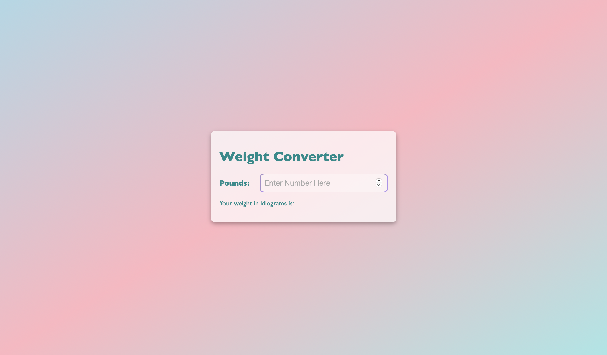

<h1> WEIGHT CONVERTER </h1>

<p> A responsive weight converter built using HTML, CSS, and Javascript. This project demonstrates the basics of interactive web design. </p>


<!--)-->




<h2> Features </h2>

<ul>
    <li> Simple and Clean Design </li>
    <li> Gradient Background </li>
    <li> User Input with Validation </li>
    <li> Pounds to Kilograms Conversion </li>
    <li> Error Handling for Invalid Input </li>
</ul>

<h2> Technologies Used </h2>

<ul>
    <li> HTML5 </li>
    <li> CSS </li>
    <li> Javascript </li>
</ul>

<h2> Project Structure </h2>

```
└── 📁weight-converter
    ├── 📁images 
    |    └── weight-converter.jpg
    ├── styles.css
    ├── index.js
    ├── .gitignore
    ├── LICENSE
    ├── index.html
    └── README.md
```
<h2> Getting Started </h2>

<ol>
    <li> Download or clone this repository. </li>
    <li> Open the project folder. </li>
    <li> Double-click <em>index.html</em>, or open it in your preferred web browser.
</ol>

<p> No additonal software or installation is needed </p>

<h2> Future Improvements </h2>

<ul>
    <li> ensure the body container expands to an appropriate size in full screen </li>
    <li> improve accessibilty </li>
</ul>

<h2> Author </h2>
<p> Created by Anaia Johnson </p>